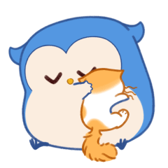

<!--Banner-->

<!--Night Owl image-->

  

<!--Header Name-->
#  IM ANGEL!! ( quickscopeman40) 
*Developer / Programmer, Aesthetic Master*
  

<!--Start Intro-->               

I Am a Full Stack Developer  

- ✨ Learned from youtube and google
- 🌱 Learing every chance i get.
- 💁‍♂️ Trusted Support Specialist at [Rapid Hosting LLC](https://rapidhosting.cloud)
- 🏙 Owner and CEO of Angel Solutions [Coming soon](https://).
- ❤ PHP Lover.
- 💻 [Portfolio]() Coming Soon.
<!--End Intro-->

<!--Profile Count Badge-->

  

---

<!--Languages and Tools Section-->       
<h2 align="center" style="color: #5032c7;">Tᴇᴄʜ sᴛᴀᴄᴋ & Lᴀᴛᴇsᴛ ʙʟᴏɢs</h2> 
<picture>
  <source media="(prefers-color-scheme: dark)" srcset="./emoji.png">
  <source media="(prefers-color-scheme: light)" srcset="./emoji.png">
  
</picture>
 

<h3 align="left" style="color: #5032c7;">Current Learning</h3>
<ul align="left">
  <li>More about PHP, CSS, HTML, JavaScript, Python, C#, C++, C, SQL, and more.</li>
  <li>Making Discord Bots in Python.</li>
  <li>Making FiveM Scripts in Lua.</li>
</ul>
  
<h3 align="left" style="color: #5032c7;">Latest Projects</h3>
<ul align="left">
  <li><a href="https://dev.to/dev_kiran/debug-like-a-pro-in-2025-3lg1" style="color: #5032c7;">😎PHP Discord Login System🧑‍💻</a></li>
</ul>
 
 
 
 

<!--Github stats Table--> 
<h2 align="center" style="color: #5032c7;">📊 Gɪᴛʜᴜʙ Sᴛᴀᴛs 📊</h2>

<table width="100%">
  <tr>
    <td width="50%">
      <h3 align="center" style="color: #5032c7;"><strong>Gɪᴛʜᴜʙ Sᴛᴀᴛs</strong></h3>
      

        
      

    </td>
    <td width="50%">
      <h3 align="center" style="color: #5032c7;"><strong>Lᴀᴛᴇsᴛ Pʀᴏᴊᴇᴄᴛ</strong></h3>
      

        
      

    </td>
    <td width="50%">
      <h3 align="center" style="color: #5032c7;"><strong>Tᴏᴘ Cᴏɴᴛʀɪʙᴜᴛɪᴏɴs</strong></h3>
      

        
      

    </td>
  </tr>
</table>
 

<!--Contribution Graph-->
<h2 align="center" style="color: #5032c7;">📈 Cᴏɴᴛʀɪʙᴜᴛɪᴏɴ Gʀᴀᴘʜ 📈</h2>

    

---

<!--Dynamic Quote card updates everyday at 12 PM--> 
<h2 align="center" style="color: #5032c7;">🌟 Tʜᴏᴜɢʜᴛ ᴏғ ᴛʜᴇ Dᴀʏ 🌟</h2>

<!--STARTS_HERE_QUOTE_CARD-->

    

<!--ENDS_HERE_QUOTE_CARD-->

Inspired by <a href="https://github.com/Kiran1689">Kiran1689</a>'s README

<!--Contact Section--> 

<!--Buy me a coffee-->

