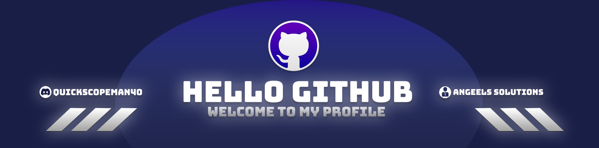
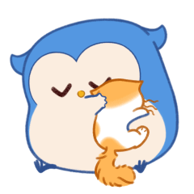

<!--Banner-->

<!--Night Owl image-->

  

<!--Header Name-->
#  IM ANGEL!! ( quickscopeman40) 
*Developer / Programmer, Aesthetic Master*
  

<!--Start Intro-->               

I Am a Full Stack Developer  

- ✨ Learned from youtube and google
- 🌱 Learing every chance i get.
- 💁‍♂️ Trusted Support Specialist at [Rapid Hosting LLC](https://rapidhosting.cloud)
- 🏙 Owner and CEO of Angel Solutions [Coming soon](https://).
- ❤ PHP Lover.
- 💻 [Portfolio]() Coming Soon.
<!--End Intro-->

<!--Profile Count Badge-->

  

---

<!--Languages and Tools Section-->       
<h2 align="center" style="color: #5032c7;">LATEST & INFORMATION</h2> 

 

<h3 align="left" style="color: #5032c7;">Current Learning</h3>
<ul align="left">
  <li>More about PHP, CSS, HTML, JavaScript, Python, C#, C++, C, SQL, and more.</li>
  <li>Making Discord Bots in Python.</li>
  <li>Making FiveM Scripts in Lua.</li>
</ul>
  
<h3 align="left" style="color: #5032c7;">Latest Projects</h3>
<ul align="left">
  <li><a href="https://comingsoon.com" style="color: #5032c7;">😎PHP Discord Login System🧑‍💻</a></li>
</ul>
 
 
 
 

<!--Github stats Table--> 

---

<!--Dynamic Quote card updates everyday at 12 PM--> 
<h2 align="center" style="color: #5032c7;">🌟 Thought of the day 🌟</h2>

<!--STARTS_HERE_QUOTE_CARD-->

    

<!--ENDS_HERE_QUOTE_CARD-->

Inspired by <a href="https://github.com/Kiran1689">Kiran1689</a>'s README

<!--Contact Section--> 

<!--Buy me a coffee-->
